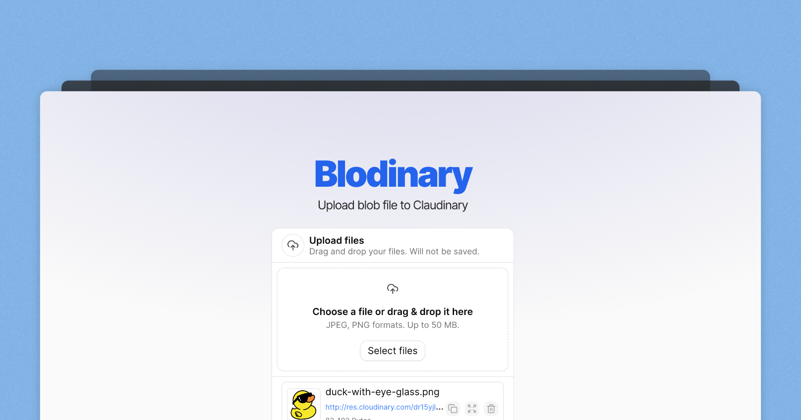
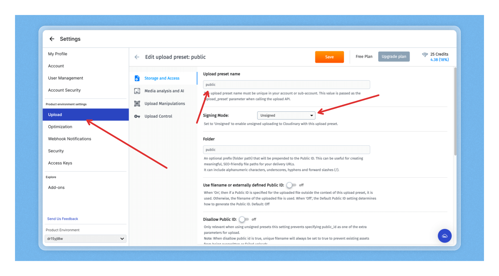

# Blodinary

Upload blob file to Claudinary powered by Next.js.

## Required!

Please make sure to setup upload preset with preset name `public` in Claudinary.

## Note

Currently we are only able to upload image files. The next step is to support uploading files other than just images.

## Credit

- Drag and Drop component from [jaumegelabert](https://jaumegelabert.dev/components/uploader).
- shadcn/ui - [ui](https://ui.shadcn.com/)

## LICENSE

MIT
